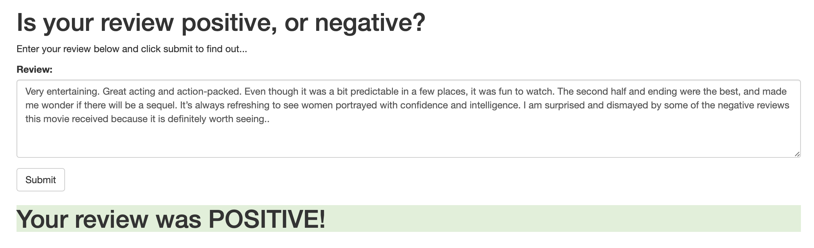
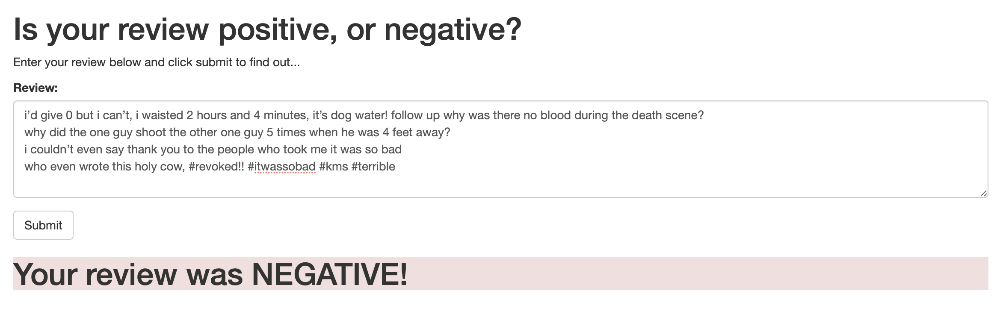

# Deep Learning Udacity Nanodegree - SageMaker Deployment Project
This project perform sentiment analysis on movie reviews using LSTM and sagemaker (AWS).
The final outcomes of the project is to illustrate if the input review is positive or negative, such as the following screenshots.

Please note that: The reviews used here are some reviews made publically availabe of the movie (355).

